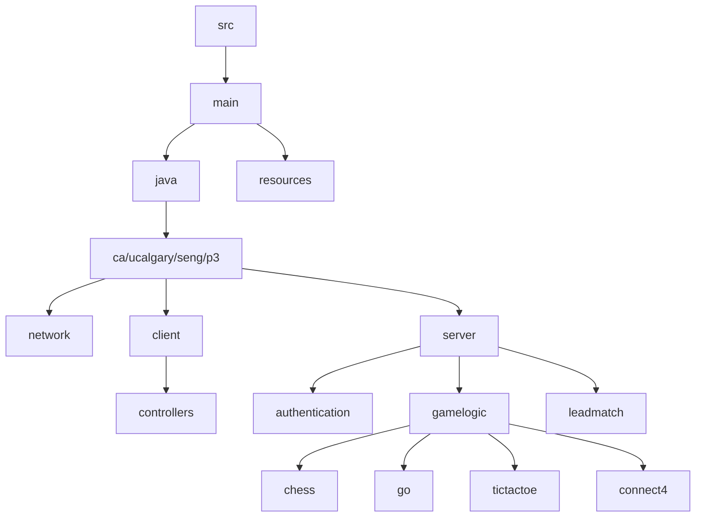

# Online Multiplayer Game Platform (OMG)

## Platform Objective
OMG enables users to play four classic board games (Chess, Connect Four, Tic-Tac-Toe, and Go) with secure multiplayer functionality. The system provides:
- Account creation and authentication
- Competitive matchmaking
- Persistent game statistics
- In-game chat functionality

## Implemented Features

### Authentication System
- User registration with password complexity requirements:
  - 8+ characters
  - 1+ uppercase letter
  - 1+ number
  - No spaces
- Account recovery via simulated email OTP
- Session management for registered users

### Game Implementations
All games enforce standard rulesets:
- **Chess**: Valid piece movements, check detection
- **Connect Four**: Column drops with win condition checking
- **Tic-Tac-Toe**: 3x3 grid with win/draw detection
- **Go**: Stone placement and territory scoring

### Multiplayer Services
- ELO-based matchmaking (initial rating: 1000)
- TCP game state synchronization
- UDP real-time chat
- CSV data storage for:
  - User credentials (`accounts.csv`)
  - Active sessions (`session.csv`)
  - Game statistics (`stats.csv`)

## How to Run This Program

### Requirements
- **Java 23 SDK**
- **JavaFX 23.0.1 SDK** ([download here](https://gluonhq.com/products/javafx/))
- **JUnit 5.8.1** (only required for running tests, not needed for the JAR)

### Run from the Provided JAR

#### Instructions from Windows
If you've installed JavaFX SDK to the default location:

java --module-path "C:\Program Files\Java\javafx-sdk-23.0.1\lib" --add-modules javafx.controls,javafx.fxml -jar seng-w25-project.jar

Make sure you adjust the path if your JavaFX SDK is installed elsewhere.

### First-Time Setup
The system will automatically generate required data files:
- `data/accounts.csv` for user accounts
- `data/session.csv` for active sessions
- `data/stats.csv` for game statistics

## Usage Instructions
1. Launch the application
2. Register an account or login as guest
3. Select a game from the lobby
4. Choose play mode:
   - Private match (invite by username)
   - Public lobby
   - Ranked matchmaking
5. Game results automatically update player statistics

## Project Structure

