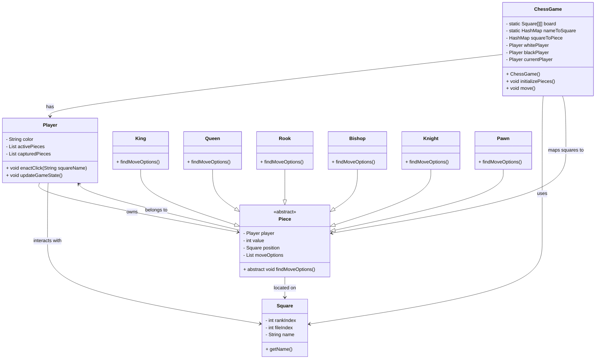

## Design Document for Chess Game

## System Overview

The chess game models players, pieces, moves, and the board using an object-oriented approach. The system allows two players to interact with a board, make valid chess moves, capture opponent pieces, and maintain game state.

Key Features:

-   OOP modeling of chess entities

-   Board state tracking and move handling

-   Dynamic calculation of legal moves

-   Turn-based interaction

---



## Detailed Class Specifications

### `ChessGame`

-   Initializes the board and player objects

-   Maintains the mapping between squares and pieces

-   Keeps track of the active player

-   Static initialization of the 8x8 board and square naming

### `Player`

-   Represents a player (white or black)

-   Stores pieces, captured pieces, and move options

-   Manages interactions and user actions (like clicks)

-   Handles movement and updating game state

### `Piece` (Abstract)

-   Parent class for all chess pieces

-   Attributes: `player`, `value`, `position`, `moveOptions`

-   Subclasses must implement `findMoveOptions()`

### Subclasses of `Piece`:

-   `King`, `Queen`, `Rook`, `Bishop`, `Knight`, `Pawn`

-   Each initializes position based on color

-   Each implements move logic via `findMoveOptions()`

### `Square`

-   Represents a square on the board

-   Fields: `rankIndex`, `fileIndex`, `name`

-   Immutable once initialized

---

## Key APIs

### Player Interaction

```java


void enactClick(String squareName);`

Handles user interaction when a square is clicked. Determines if a move is to be made or if a piece is selected/deselected.
```

### Move Execution

```java


void move();`

Moves the selected piece to a clicked square and updates the game state accordingly.
```

### Initialization

```java
public ChessGame();`

Initializes players, board, and game mappings.
```

```java
public void initializePieces();`

Sets up the player's pieces in their starting positions.
```

---

## Data Storage

### Board Structure

```java


`public static final Square[][] board;`

-   2D array representing 8x8 chess board

-   Initialized with named squares (e.g., "a1", "e4")
```

### Square Mapping

```java
public static final HashMap<String, Square> nameToSquare;`

-   Maps square names to `Square` objects for lookup
```

### Piece Location Tracking

```java
public HashMap<Square, Piece> squareToPiece;`

-   Tracks which piece is on which square
```

---

## Error Handling

### Move Validation

-   Moves are only executed if the destination square is valid

-   Invalid selections clear move options and deselect current piece

### Null Handling

-   All interactions guard against null references

-   Clicking on empty or invalid squares results in safe no-ops

### Game Logic Isolation

-   Each player and piece is responsible for maintaining its own valid state

-   Movement logic ensures captured pieces are removed and scores updated
