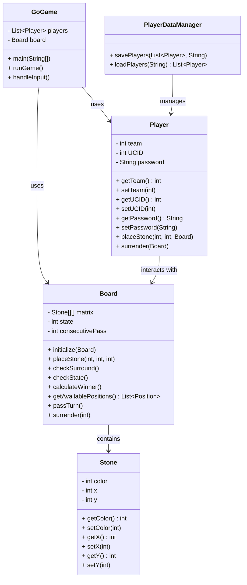

## System Overview

This Go game is a console-based implementation of the traditional board game Go. It supports:

-   Two-player gameplay (Black and White)

-   Stone placement on a 19x19 board

-   Rule enforcement for capturing surrounded stones

-   Game-ending conditions (two consecutive passes or surrender)

-   Player data persistence using JSON

-   Simple user interaction via command-line interface

---

## Detailed Class Specifications

### `Board`

Handles core gameplay logic, game state, and board configuration.

**Key Attributes:**

-   `Stone[][] matrix` -- 19x19 grid representing the board.

-   `int state` -- 0 = ongoing, 1 = black wins, 2 = white wins, 3 = surrender.

-   `int consecutivePass` -- Tracks consecutive passes.

**Key Methods:**

-   `initialize(Board b)` -- Initializes the board.

-   `placeStone(int x, int y, int color)` -- Places a stone if the position is valid.

-   `checkSurround()` -- Checks and clears surrounded stones.

-   `checkState()` -- Determines if the game should end.

-   `calculateWinner()` -- Determines winner by counting territory and stones.

-   `getAvailablePositions()` -- Returns list of unoccupied positions.

-   `passTurn()` -- Handles pass logic.

-   `surrender(int team)` -- Ends the game by surrender.

---

### `Stone`

Represents an individual stone on the board.

**Attributes:**

-   `int color` -- 0 = blank, 1 = black, 2 = white, 3 = black captured, 4 = white captured.

-   `int x, y` -- Position coordinates on the board.

**Methods:**

-   Getters and setters for `color`, `x`, and `y`.

---

### `Player`

Represents a player in the game.

**Attributes:**

-   `int team` -- 1 = black, 2 = white.

-   `int UCID` -- Unique identifier for the player.

-   `String password` -- Player password.

**Methods:**

-   Getters and setters for all attributes.

-   `placeStone(int x, int y, Board board)` -- Places stone on the board.

-   `surrender(Board board)` -- Triggers surrender on the board.

---

### `GoGame`

Main class for running the game loop and managing user input/output.

**Key Features:**

-   Loads/saves player data from `players.json`.

-   Accepts input (`x y`, `pass`, `surrender`) from the console.

-   Displays board (simplified 5x5 for testing).

-   Handles turn switching and game state updates.

---

### `PlayerDataManager`

Handles loading and saving player data using JSON files.

**Methods:**

-   `savePlayers(List<Player>, String filename)` -- Saves to file.

-   `loadPlayers(String filename)` -- Loads from file.

---

## Key APIs

| Method Signature                                      | Description                             |
| ----------------------------------------------------- | --------------------------------------- |
| `Board.placeStone(int x, int y, int color)`           | Place a stone at a specific coordinate. |
| `Board.getAvailablePositions()`                       | Returns all unoccupied positions.       |
| `Board.surrender(int team)`                           | Player surrenders the match.            |
| `PlayerDataManager.savePlayers(List<Player>, String)` | Persists player data to a file.         |
| `PlayerDataManager.loadPlayers(String)`               | Loads player data from a file.          |

---

## Data Storage

-   Player information is persisted to `players.json` using **Jackson ObjectMapper**.

-   Each `Player` object is serialized/deserialized with the following fields:

    -   `team`

    -   `UCID`

    -   `password`

---

## Error Handling

**Implemented Strategies:**

-   Try-catch blocks in `GoGame` for:

    -   Parsing input

    -   File I/O during player data load/save

-   `Board.placeStone()` checks for:

    -   Invalid coordinates

    -   Already occupied positions

-   Fallback player initialization if file read fails.
