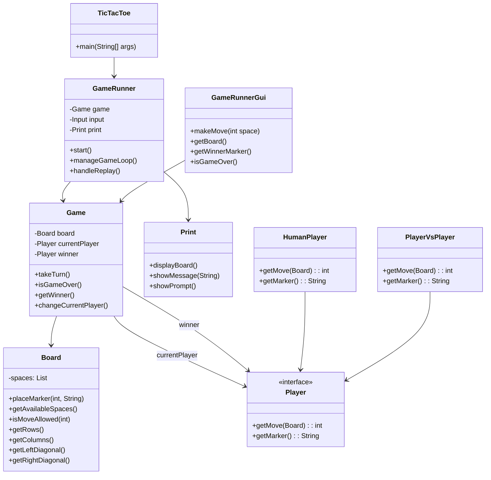

## Detailed Class Specifications

### `TicTacToe`

-   **Purpose:** Main entry point. Initializes input/output systems and launches the `GameRunner`.

-   **Key Methods:** `main(String[] args)`

---



### `GameRunner`

-   **Purpose:** Drives the CLI version of the game loop including setup, play, and end handling.

-   **Responsibilities:**

    -   Starts the game

    -   Manages game progression

    -   Asks user to replay or quit

-   **Key Fields:** `Game game`, `Input input`, `Print print`

---

### `GameRunnerGui`

-   **Purpose:** GUI controller using event-driven logic.

-   **Responsibilities:**

    -   Provides GUI-safe access to game state

    -   Accepts user move inputs and updates state

-   **Key Methods:** `makeMove(int space)`, `getBoard()`, `getWinnerMarker()`, `isGameOver()`

---

### `Game`

-   **Purpose:** Core game logic engine.

-   **Responsibilities:**

    -   Maintains the board

    -   Manages players and turns

    -   Checks for game over conditions

-   **Key Methods:** `takeTurn()`, `isGameOver()`, `getWinner()`

---

### `Board`

-   **Purpose:** Represents the Tic-Tac-Toe board.

-   **Responsibilities:**

    -   Tracks board state and allowed moves

    -   Detects rows, columns, and diagonals for win conditions

-   **Key Methods:** `placeMarker()`, `getAvailableSpaces()`, `getRows()`, `getColumns()`, `getLeftDiagonal()`, `getRightDiagonal()`

---

### `Print`

-   **Purpose:** Encapsulates CLI output rendering.

-   **Responsibilities:**

    -   Displays board, messages, and prompts

    -   Formats game visuals

---

### `Player`, `HumanPlayer`, `PlayerVsPlayer`

-   **Purpose:** Abstractions and implementations for players.

-   **Responsibilities:**

    -   Get user moves

    -   Hold player markers (`X` or `O`)

---

### `Quit`

-   **Purpose:** Menu option to quit the game.

-   **Implements:** `Options` interface

---

## Key APIs

### Game Flow Methods

```java
Game.takeTurn();               // Executes a player move
Game.isGameOver();            // Returns if game ended
Game.getWinner();             // Returns the winner player object
Game.changeCurrentPlayer();   // Switches turns`
```

### Board Utilities

```java

Board.placeMarker(int, String);     // Places a marker on the board
Board.getAvailableSpaces();         // Returns all empty spaces
Board.isMoveAllowed(int);           // Validates a move
Board.getRows();                    // Retrieves board rows
Board.getColumns();                 // Retrieves board columns`
```

### GUI Interface Methods

```java
GameRunnerGui.makeMove(int);       // Processes a GUI move click
GameRunnerGui.getBoard();          // Returns the board state
GameRunnerGui.getWinnerMarker();   // Gets winner for GUI`
```

---

## Data Storage

### Board State

-   **Type:** `List<String> spaces`

-   **Structure:** A flat list representing a 3x3 grid with initial values "1" to "9".

-   **Access:** Index-based, with utility methods for rows, columns, and diagonals.

### Players

-   Each player has a marker (`X` or `O`) and implements the `Player` interface.

### Game State

-   Fields include current player, board object, winner (nullable).

-   State updates occur after every turn.

---

## Error Handling

### Invalid Moves

-   Attempting to move on an occupied or out-of-bounds space throws an `IllegalMoveException`.

### Input Validation

-   CLI input is validated using the `Input` class to ensure only valid menu options or move numbers are accepted.
