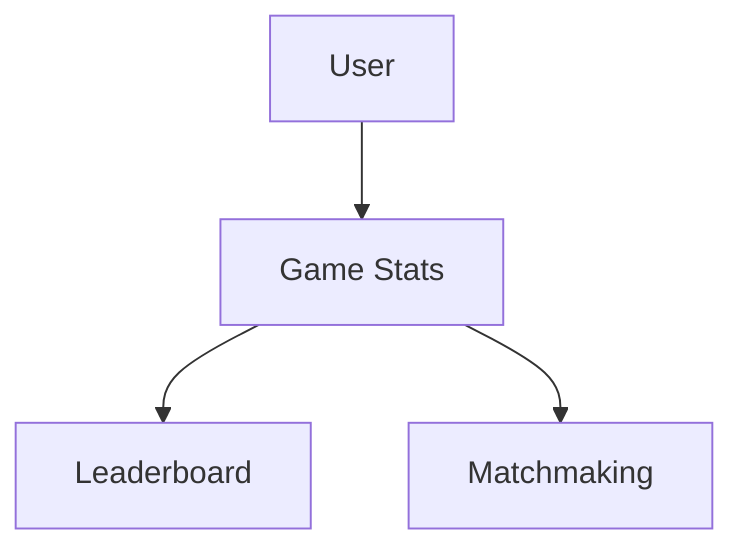
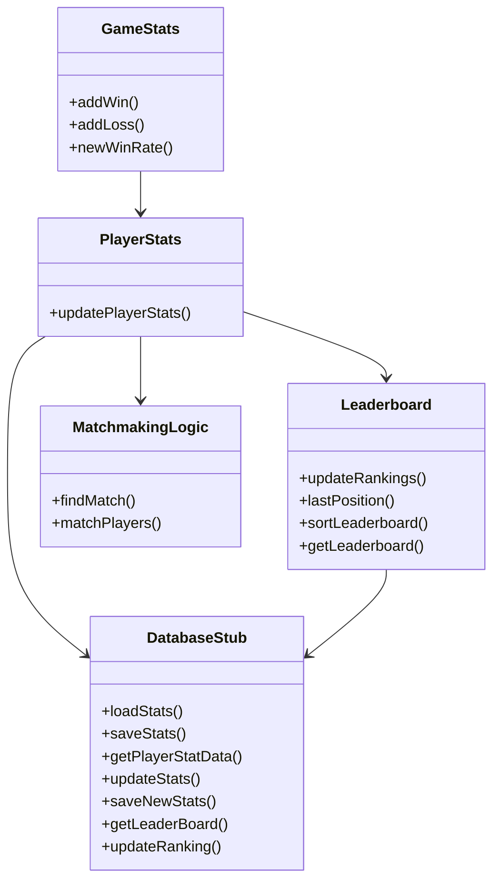

# Leaderboard & Matchmaking System Design Document

## Table of Contents
1. [System Overview](#system-overview)
2. [Class Diagram](#class-diagram)
3. [Detailed Class Specifications](#detailed-class-specifications)
4. [Integration Points](#integration_points)
5. [Data Storage](#data-storage)
6. [Error Handling](#error-handling)

## System Overview
The leaderboard and matchmaking system provides:
- Individual game stats for each user
- Leaderboard based on players game stats
- Matchmaking based on players stats



## Class Diagram


## Detailed Class Specifications

### 1. DatabaseStub
**Purpose**: Stub for database. Stores game stats and rankings in a cvs file
- Stores game stats in CSV format:  
  `games played,games won,ELO,rank`  
- User stats stored in CSV format:  
  `username,chess stats,connect4 stats,go stats,tictactoe stats`

### 2. GameStats
**Purpose**: Stores info on player's game stats for each specific game  
**Data**: 
- Games played
- Games won
- ELO
- Rank

### 3. Leaderboard
**Purpose**: Manages leaderboard changes
**Methods**:
```java
public static void updateRankings(String gameType) {
    // Updates players rank according to the players elo
    // Used after a game to update the leaderboard/players ranks
}

public static int lastPosition(String gameType) {
    // Returns last position in leaderboard
    // Used when adding new user to leaderboard
}

private static void sortLeaderboard(LeaderboardData leaderboardData){
    // Sorts the leaderboard based on player scores 
}

public static LeaderboardData getLeaderboard(String gameType){
    // Returns current leaderboard from database
}
```

### 4. LeaderboardData
**Purpose**: Data structure for each games leaderboard  
**Data**: 
- Player ID
- Player score

### 5. LeaderboardDataTest
**Purpose**: Tests leaderboard functionality

### 6. MatchData
**Purpose**: Stores data of finished match  
**Data**: 
- Player username
- Opponent username
- Game outcome
- Number of turns

### 7. MatchmakingLogic
**Purpose**: Matches player to an opponent within skill range  
**Operations**:
- Player is added to matchmaking system
- If another player within a certain skill range(based on ELO) is also in system, match players
- If not, player is not matched with anyone

### 8. PlayerStatData
**Purpose**: Stores data on overall game stats  
**Data**: 
- Overall games played
- Overall games won
- Overall winrate
- Game stats for each game
- Match history

### 9. PlayerStats
**Purpose**: Updates database and player stats after a game is completed  
**Operations**:
- Updates leaderboard
- Updates both players stats for the given game
- Updates ELO based on outcome and rank difference of both players


## Integration Points

1. **Game Logic** → `matchPlayers`
   - Begin game if matching is successful
2. **Profile** → `ViewPlayerProfile`
   - Player stats display
3. **Authentication** → `FailedLogin`
   - Account status verification


## Data Storage

### stats.csv
```
username,chess stats,connect4 stats,go stats,tictactoe stats

```


## Error Handling
| Error Case               | User Feedback                  | System Action                     |
|--------------------------|--------------------------------|-----------------------------------|
| No stats for user        | "No stats found for player ..."    | Throw exception                   |
| No player to match with  | "No match found for player with ELO ..."| End matchmaking              |

