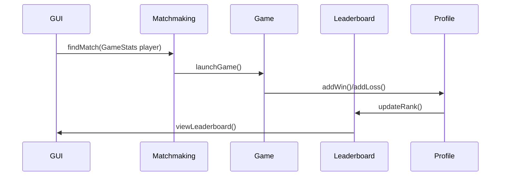

# Leaderboard & Matchmaking System Integration Document

## 1. Overview
### Purpose
- Update players position in leaderboard post match
- Match players to suitable opponents
- Update players individual/profile stats post match
- Update players match history

### Audience
- Game Logic
- Authentication/Profile
- Networking
- GUI

## 2. Data Flow

## 3. Suggested Integration Steps
- Ensure that after a game ends, both leaderboard and profile is updated with changes (Game logic, Authentication, Matchmaking)
- Once player chooses a game they enter a queue to match with other players (Networking, Matchmaking)
- Once player is matched with opponent, they enter game lobby (Game logic, Matchmaking, GUI)
- Player is able to view placement in leaderboard (Matchmaking, GUI)

## 4. Testing

| Test Case            | Expected Result                      |
|----------------------|--------------------------------------|
| `Game win`           | Profile stats and leaderboard updated|
| `Game loss`          | Profile stats and leaderboard updated|
| `Opponent leaves ongoing match`| Match is marked as win for player and profile stats and leaderboard updated|

## 5. Error Management

| Error                | Solution                             |
|----------------------|--------------------------------------|
| `Opponent times out or exits during game`           | Game ends and match is marked as win for player|
