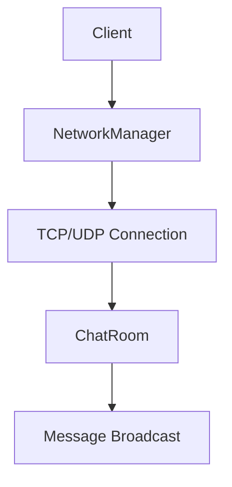
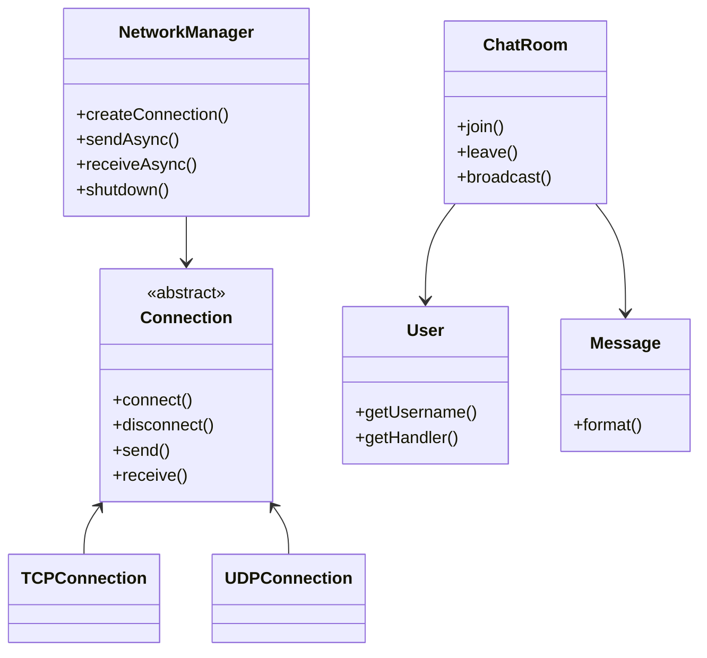
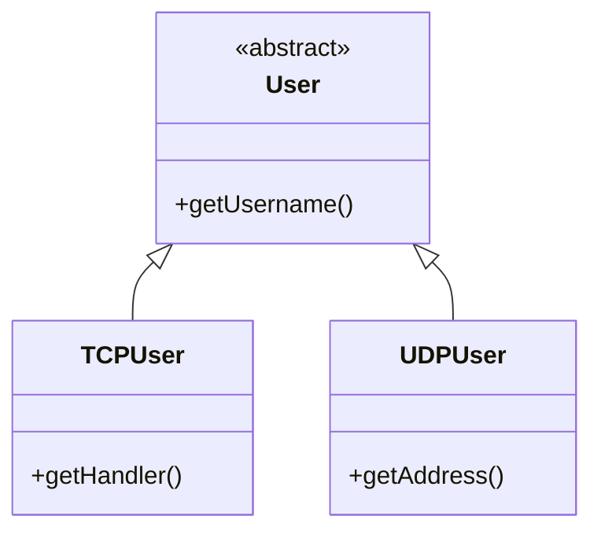
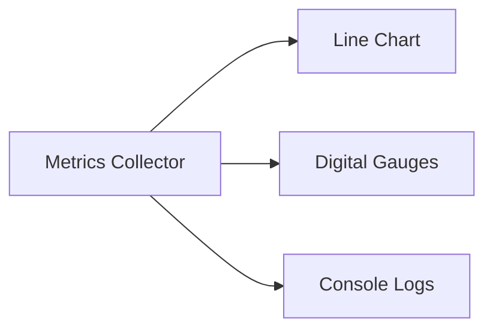

# Server System Design Document

## Table of Contents
1. [System Overview](#system-overview)
2. [Class Diagram](#class-diagram)
3. [Detailed Class Specifications](#detailed-class-specifications)
4. [Key APIs](#key-apis)
5. [Protocol Specifications](#protocol-specifications)
6. [Performance Considerations](#performance-considerations)
7. [Integration Points](#integration-points)
8. [Error Handling](#error-handling)
9. [Monitoring](#monitoring)

## System Overview
The server system provides:
- Multi-protocol communication (TCP/UDP)
- Chat room functionality
- Client connection management
- Load balancing and monitoring



## Class Diagram


## Detailed Class Specifications

### 1. NetworkManager
**Purpose**: Central network operation coordinator  
**Key Features**:
- Thread-safe connection management
- Asynchronous I/O operations
- Graceful shutdown
```java
public void sendAsync(Connection c, byte[] data) {
    // Non-blocking send operation
}
```

### 2. Connection (Abstract Base Class)
**Protocol Support**:
| Type | Port | Implementation Class |
|------|------|----------------------|
| TCP  | 8080 | `TCPConnection`      |
| UDP  | 9090 | `UDPConnection`      |

### 3. ChatRoom
**Responsibilities**:
- Real-time message broadcasting
- User presence management
```java
public void broadcast(Message msg) {
    // Sends to all connected users
}
```

### 4. User Hierarchy


### 5. Message Class
**Format**:
```
[HH:mm:ss] username: message_content
```
**Features**:
- Automatic timestamping
- Protocol-agnostic formatting

### 6. TCPserverLoadTester
**Monitoring Capabilities**:
- Real-time metrics display
- Automated client simulation
- Performance visualization

## Key APIs

### Connection API
```java
public interface Connection {
    void send(byte[] data) throws IOException;
    byte[] receive() throws IOException;
    void disconnect() throws IOException;
}
```

### ChatRoom API
```java
public class ChatRoom {
    public void join(User user);  // Adds user to active set
    public void leave(User user); // Removes user
    public void broadcast(Message msg); // Sends to all users
}
```

## Protocol Specifications

### TCP Protocol
- Connection-oriented
- Port: 12345 (primary), 8080 (test)
- Message format: UTF-8 text with newline terminator

### UDP Protocol
- Connectionless
- Port: 9090
- Datagram format:
  ```plaintext
  username:message
  ```

## Performance Considerations

| Scenario              | TCP Handling              | UDP Handling              |
|-----------------------|---------------------------|---------------------------|
| High message volume   | Thread pool (50 threads)  | Single receiver thread    |
| Network latency       | Nagle's algorithm off     | No congestion control     |
| Memory usage          | 1KB buffer per connection | Shared 1KB buffer         |

## Integration Points

1. **Authentication → User Creation**
   ```java
   // After a successful login:
   User user = new TCPUser(username, handler);
   chatRoom.join(user);
   ```

2. **Game Logic → Messaging**
   ```java
   Message gameMsg = new Message(move.toString(), player);
   chatRoom.broadcast(gameMsg);
   ```

3. **Monitoring → System Metrics**
   ```java
   // In the class TCPserverLoadTester:
   cpuLabel.setText("CPU: " + osBean.getSystemCpuLoad());
   ```

## Error Handling

| Error Type               | Recovery Action                     |
|--------------------------|-------------------------------------|
| Connection timeout       | Automatic reconnect (3 attempts)    |
| Full message buffer      | Discard oldest messages             |
| Invalid message format   | Send error response to sender       |
| Socket exception         | Log and clean up connection         |

## Monitoring

**TCPserverLoadTester Metrics**:
1. Active threads count
2. Connected clients
3. Messages/second
4. CPU utilization (%)
5. Memory usage (MB)

**Visualization**:


## Session Management

| Feature         | TCP Implementation      | UDP Implementation      |
|----------------|-------------------------|-------------------------|
| User tracking  | ClientHandler instances | InetSocketAddress map   |
| Timeouts       | 5s read timeout         | 5m inactivity timeout   |
| Cleanup        | Explicit disconnect     | Periodic sweep          |
