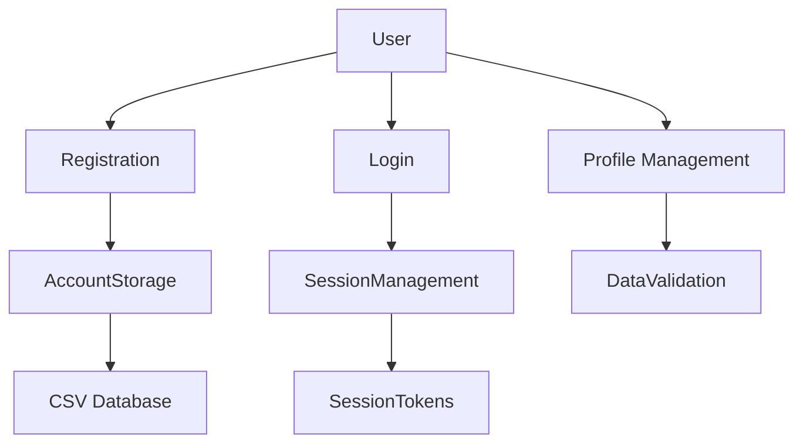
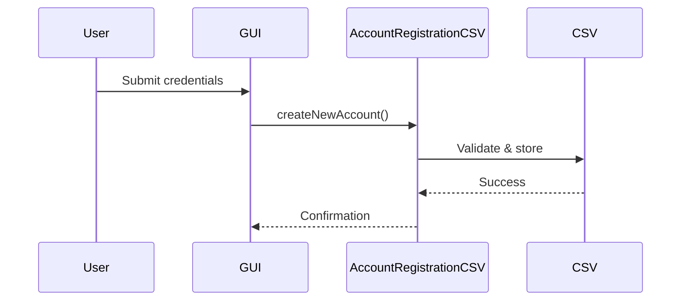
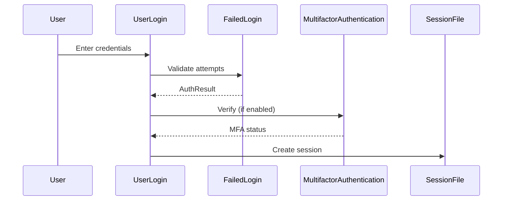
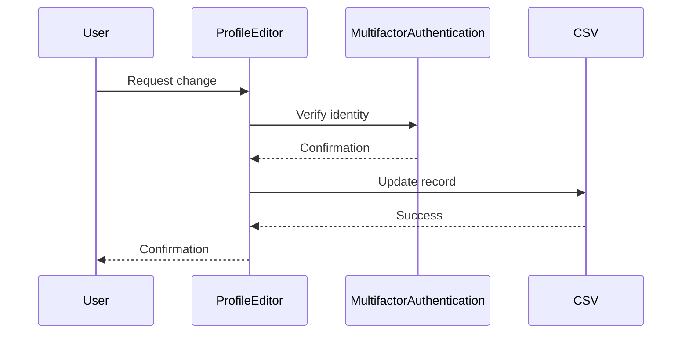
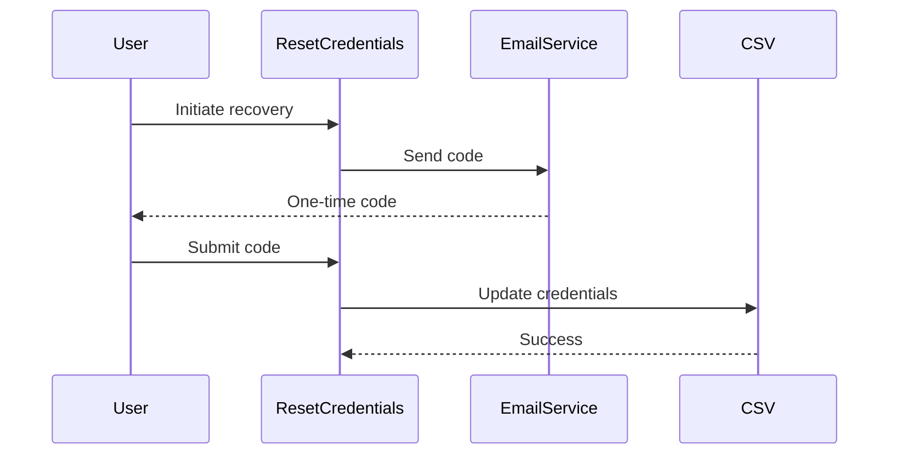

# Authentication System Design Document

## Table of Contents
1. [System Overview](#system-overview)
2. [Core Components](#core-components)
3. [API Specifications](#api-specifications)
4. [Data Flow](#data-flow)
5. [Security Implementation](#security-implementation)
6. [Error Handling](#error-handling)
7. [Integration Points](#integration-points)
8. [Testing Protocol](#testing-protocol)
9. [Database Schema](#database-schema)
10. [Sequence Diagrams](#sequence-diagrams)

---

## System Overview


## Core Components

### 1. Account Management
| Class | Purpose |
|-------|---------|
| `AccountRegistrationCSV` | Handles new user registration |
| `AccountDeletion` | Manages account removal |
| `ResetCredentials` | Password/username recovery |

### 2. Authentication
| Class | Purpose |
|-------|---------|
| `UserLogin` | Main login handler |
| `FailedLogin` | Brute-force protection |
| `MultifactorAuthentication` | 2FA implementation |

### 3. Profile Services
| Class | Purpose |
|-------|---------|
| `ProfileEditor` | Profile modification |
| `ViewPlayerProfile` | Profile display |

### 4. Session Management
| Class | Purpose |
|-------|---------|
| `UserLogin` | Session creation |
| `UserLogout` | Session termination |

---

## API Specifications

### Registration API
```java
public class AccountRegistrationCSV {
    public static void createNewAccount(Scanner scanner) throws IOException;
    public static Map<String, String[]> loadAccounts() throws IOException;
}
```

### Authentication API
```java
public class UserLogin {
    public static void login(Scanner scanner);
    public static void guestLogin();
    public static Map<String, String> loadAccounts();
}
```

### MFA API
```java
public class MultifactorAuthentication {
    public static boolean startMFAProcess(Scanner scanner, String username);
    private static String generateOneTimeCode(int length);
}
```

---

## Data Flow

### Registration Flow


### Login Flow


---

## Security Implementation

### Password Handling
```java
// In PasswordHasher
public static String hashPassword(String password);
public static boolean verifyPassword(String input, String storedHash);
```

### Brute Force Protection
```java
// In FailedLogin
private final Map<String, Integer> failedAttempts;
private static final int MAX_ATTEMPTS = 5;
private static final long LOCK_DURATION = 15*60*1000; // 15 minutes
```

### MFA Implementation
- 6-digit one-time codes
- Valid for 1 hour
- 3 attempt limit

---

## Error Handling

| Error Case | Handling Mechanism |
|------------|--------------------|
| Duplicate username | Immediate rejection |
| Invalid password | Attempt counter |
| Locked account | 15-minute timeout |
| MFA failure | Session termination |

---

## Integration Points

### With Game Systems
```java
// Sample integration
if (UserLogin.isUserLoggedIn(username)) {
    gameSession.start();
} else {
    showLoginPrompt();
}
```

### With Leaderboard
```java
// In ViewPlayerProfile
matchHistory.displayMatchHistoryForPlayer(playerStats);
```

---

## Testing Protocol

### Unit Tests
```java
@Test
void testPasswordHashing() {
    String hash = PasswordHasher.hashPassword("test123");
    assertTrue(PasswordHasher.verifyPassword("test123", hash));
}

@Test
void testAccountDeletion() {
    assertTrue(AccountDeletion.deleteAccount("test", "pass"));
}
```

### Integration Tests
1. Full registration → login → gameplay flow
2. MFA failure scenarios
3. Concurrent access tests

---

## Database

### accounts.csv
```
username,hashed_password,email,mfa_enabled
testuser,$2a$10$N9qo8uLO...,user@test.com,true
```

### session.csv
```
username
timestamp
```

---

## Sequence Diagrams

### Profile Update


### Account Recovery
