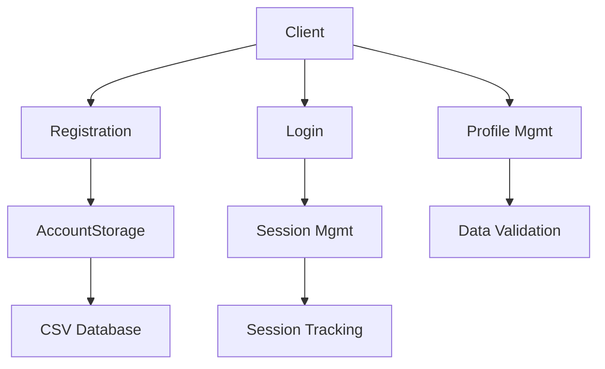
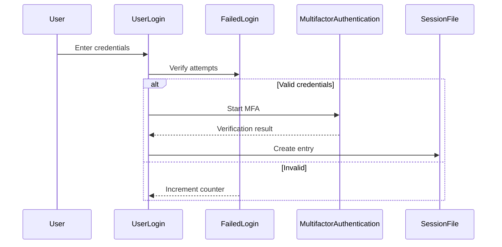

# Authentication System Documentation

## Table of Contents
1. [System Architecture](#system-architecture)
2. [Component Deep Dive](#component-deep-dive)
3. [Data Flow](#data-flow)
4. [Security Model](#security-model)
5. [Error Handling](#error-handling)
6. [Testing Strategy](#testing-strategy)
7. [Database Schema](#database-schema)
8. [Integration Guide](#integration-guide)
9. [Future Roadmap](#future-roadmap)

---

## System Architecture

### Overview
The authentication system provides:
- User account lifecycle management
- Secure credential storage
- Session handling
- Multi-factor authentication
- Profile services



---

## Component Deep Dive

### 1. Account Registration (`AccountRegistrationCSV.java`)
**Responsibilities**:
- Validates new account credentials
- Enforces password policies
- Stores accounts in CSV format

**Key Methods**:
```java
public static void createNewAccount(Scanner scanner) {
    // Implements multi-step registration:
    // 1. Username uniqueness check
    // 2. Password complexity verification
    // 3. Email format validation
    // 4. CSV append operation
}
```

**Password Requirements**:
1. Minimum 8 characters
2. At least 1 uppercase letter
3. At least 1 digit
4. No whitespace

---

### 2. Login System (`UserLogin.java`)
**Authentication Flow**:
1. Credential validation
2. Failed attempt tracking
3. MFA triggering (when enabled)
4. Session creation



---

### 3. Multi-Factor Authentication (`MultifactorAuthentication.java`)
**Implementation Details**:
- Generates 6-digit OTP codes
- Valid for 60 minutes
- Maximum 3 attempts
- Simulated email delivery

**Code Generation**:
```java
private static String generateOneTimeCode(int length) {
    // Uses SecureRandom for cryptographic safety
    // Format: 6 numeric digits (0-9)
}
```

---

## Data Flow

### Registration Process
1. Client submits credentials
2. System validates inputs
3. Password is hashed (BCrypt)
4. Record appended to CSV

```csv
username,hashed_password,email,mfa_enabled
testuser,$2a$10$N9qo...,user@test.com,true
```

---

## Security Model

### Protection Mechanisms
1. **Brute Force Prevention**:
   - Account lock after 5 failed attempts
   - 15 minute lockout period

2. **Data Protection**:
   - Password hashing with BCrypt
   - Session file isolation

3. **MFA Security**:
   - Time-limited OTP codes
   - Attempt throttling

---

## Error Handling

### Common Scenarios
| Error Case | Handling | User Feedback |
|------------|----------|---------------|
| Duplicate username | Reject registration | "Username taken" |
| Weak password | Reject input | Show requirements |
| MFA failure | Terminate flow | "Too many attempts" |

---

## Testing Strategy

### Unit Tests
```java
@Test
void testPasswordHashing() {
    String hash = PasswordHasher.hashPassword("Secure123!");
    assertTrue(PasswordHasher.verifyPassword("Secure123!", hash));
}
```

### Integration Tests
1. Complete registration → login → gameplay flow
2. Concurrent access scenarios
3. MFA failure paths

---

## Database Schema

### accounts.csv
| Column | Type | Description |
|--------|------|-------------|
| username | String | Primary key |
| password | String | BCrypt hash |
| email | String | User contact |
| mfa_enabled | Boolean | MFA flag |

### session.csv
| Column | Description |
|--------|-------------|
| username | Active sessions |

---

## Integration Guide

### For Game Servers
```java
// Verify active session
if (UserLogin.isUserLoggedIn(username)) {
    // Grant game access
}
```

### For Leaderboards
```java
// Fetch player stats
ViewPlayerProfile profile = new ViewPlayerProfile(username);
profile.display();
```

---