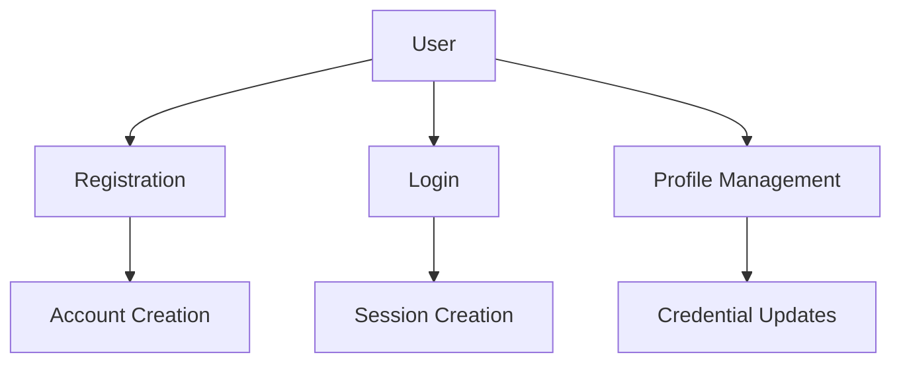
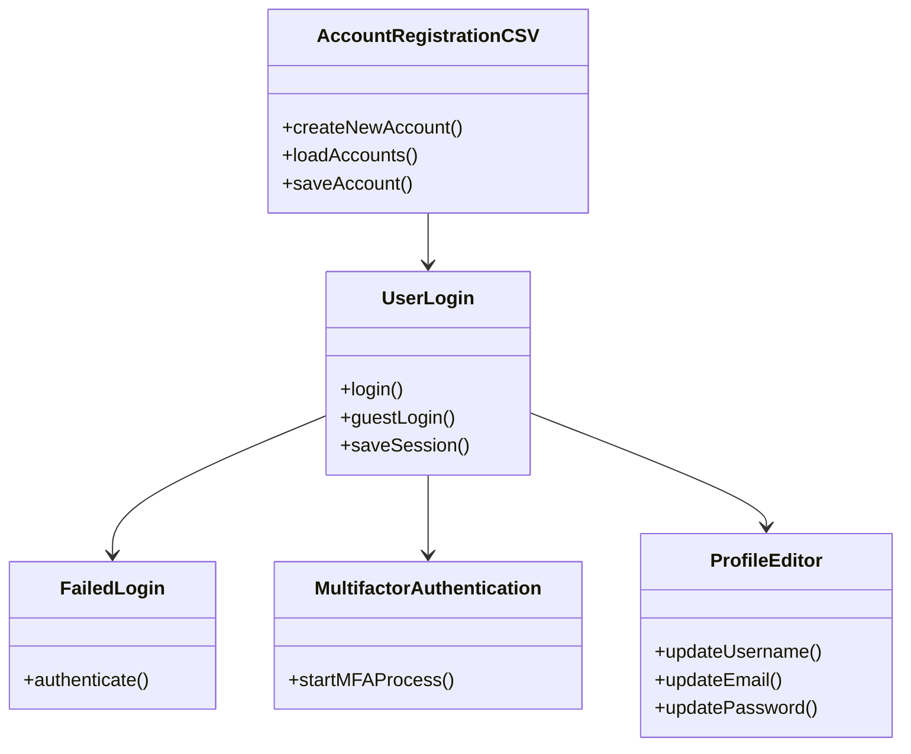

# Authentication System Design Document

## Table of Contents
1. [System Overview](#system-overview)
2. [Class Diagram](#class-diagram)
3. [Detailed Class Specifications](#detailed-class-specifications)
4. [Key APIs](#key-apis)
5. [Data Storage](#data-storage)
6. [Integration Points](#integration-points)
7. [Security Considerations](#security-considerations)
8. [Error Handling](#error-handling)
9. [Session Management](#session-management)

## System Overview
The authentication system provides:
- User registration/login
- Credential management
- Session handling
- Multi-factor authentication (MFA)
- Account security features



## Class Diagram


## Detailed Class Specifications

### 1. AccountRegistrationCSV
**Purpose**: Handles new user account creation  
**Key Features**:
- Validates username uniqueness
- Enforces password complexity:
  ```java
  // Password must contain:
  - 8+ characters
  - 1 number
  - 1 uppercase letter
  - No spaces
  ```
- Stores accounts in CSV format:  
  `username,hashed_password,email,mfa_enabled`

### 2. UserLogin
**Purpose**: Manages user authentication flows  
**Methods**:
```java
public static void login(Scanner scanner) {
    // Handles:
    // - Credential verification
    // - MFA triggering
    // - Session creation
}

public static void guestLogin() {
    // Creates temporary guest accounts
    // Format: "Guest" + 5 random digits
}
```

### 3. FailedLogin
**Purpose**: Implements account lockout security  
**Mechanisms**:
- Tracks failed attempts (`MAX_ALLOWED_ATTEMPTS = 5`)
- Uses concurrent collections for thread safety

### 4. MultifactorAuthentication
**Purpose**: Adds secondary authentication layer  
**Flow**:
1. Generates 6-digit OTP (valid for 1 hour)
2. "Sends" to registered email (simulated)
3. Validates user input (3 attempts max)

### 5. ProfileEditor
**Purpose**: Allows users to modify account details  
**Operations**:
- Username changes (with uniqueness check)
- Email updates (with format validation)
- Password resets (with complexity enforcement)
- Requires MFA verification for all changes

### 6. ResetCredentials
**Purpose**: Self-service credential recovery  
**Features**:
- Email-based verification
- One-time codes (simulated)
- Guided password/username reset flows

### 7. AccountDeletion
**Purpose**: Permanent account removal  
**Security**:
- Requires password confirmation
- Immediate CSV record removal
- No recovery option

### 8. UserLogout
**Purpose**: Terminates active sessions  
**Process**:
1. Confirms logout intention
2. Removes user from `session.csv`
3. Redirects to login screen

### 9. ViewPlayerProfile
**Purpose**: Displays user information  
**Data Shown**:
- Username
- Email (partially masked)
- Match history (integrated with GameStats)

## Key APIs

### Authentication API
```java
public class AuthService {
    public static boolean validateCredentials(String username, String password) {
        // 1. Check account lock status
        // 2. Verify password hash
        // 3. Return validation result
    }
    
    public static String generateSessionToken(String username) {
        // Returns JWT with 24h expiry
    }
}
```

### MFA API
```java
public class MFAService {
    public static boolean verifyUser(String username, String code) {
        // Validates OTP against generated code
    }
    
    public static void sendVerification(String email) {
        // Simulates email dispatch
    }
}
```

## Data Storage

### accounts.csv
```
username,password_hash,email,mfa_enabled
testuser,$2a$10$N9qo...,user@test.com,true
guest123,,,false
```

### session.csv
```
username1
username2
Guest38472
```

## Integration Points

1. **Game Client** → `UserLogin`
   - Login/guest session initiation
2. **Leaderboard** → `ViewPlayerProfile`
   - Player stats display
3. **Matchmaking** → `FailedLogin`
   - Account status verification


       
## Security Considerations

| Feature               | Implementation              |
|-----------------------|-----------------------------|
| Password Storage      | BCrypt hashing             |
| Brute Force Protection| Account lockout            |
| Session Management    | File-based tracking        |
| Data Transmission     | TLS recommended           |
| MFA                   | Time-based OTP simulation  |

## Error Handling

| Error Case               | User Feedback                  | System Action                     |
|--------------------------|--------------------------------|-----------------------------------|
| Invalid credentials      | "Invalid username/password"    | Increments failed attempt counter |
| MFA failure              | "Incorrect verification code"  | Allows retries (max 3)            |

## Session Management

**Guest Sessions**:
- Auto-generated IDs (`GuestXXXXX`)
- No persistence requirements

**Registered User Sessions**:
- Tracked in `session.csv`
- Survive application restarts
- Manual logout required


---