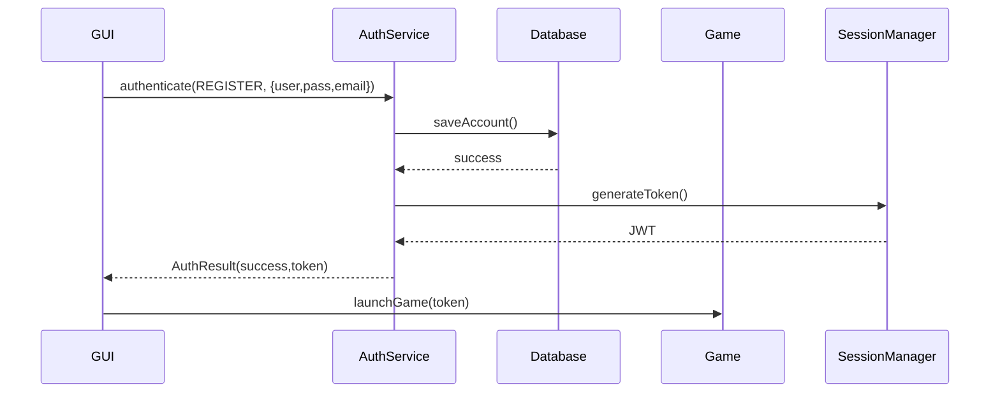

# Authentication System Integration Document

## 1. Overview
### Purpose
- Centralized authentication handling for:
  - User registration
  - Account login
  - Guest access
  - Session management

### Components
| Component            | Description                          |
|----------------------|--------------------------------------|
| `AuthService`        | Main integration interface           |
| `AccountDatabase`    | CSV persistence layer                |
| `SessionManager`    | JWT token generator/validator        |

## 2. Suggested Integration API

### Core Methods
```java
// Primary authentication endpoint
public static AuthResult authenticate(AuthType type, Map<String,String> credentials)

// Session validation
public static boolean validateToken(String jwtToken)
```

### AuthResult Object
```java
public class AuthResult {
    public boolean success;      // Auth status
    public String sessionToken;  // JWT token (valid 24h)
    public String error;         // Failure reason
    
    // Example usage:
    AuthResult result = AuthService.authenticate(
        AuthService.AuthType.LOGIN,
        Map.of("username","player1", "password","p@ssw0rd")
    );
}
```

## 3. Data Flow



## 4. Security Implementation

### Password Handling
```java
// Hashing
String hashed = BCrypt.hashpw(rawPassword, BCrypt.gensalt());

// Verification
BCrypt.checkpw(inputPassword, storedHash);
```

### CSV File Format
```
username,hashed_password,email,account_type
testuser,$2a$10$N9qo8uLOickgx2ZMRZoMy...,user@test.com,REGISTERED
```

## 5. Error Management

### Error Handling (API)
```java
try {
    AuthService.register(user);
} catch (AuthException e) {
    // Programmatic recovery
    if (e.getCode().equals("AUTH-002")) {
        showError("Username taken. Try " + suggestAltName());
    }
}
```

### Troubleshooting (Ops)
**Issue**: Users can't register  
**Diagnosis**:
1. Check CSV file permissions: `ls -la accounts.csv`
2. Verify disk space: `df -h`
3. Search logs: `grep "AUTH-002" auth.log`

**Resolution**:
```bash
chmod 600 accounts.csv  # Restrict permissions
systemctl restart auth-service
```

## 6. Suggested Integration Steps

### For GUI Team
1. Replace existing login dialog with:
```java
Map<String,String> creds = Map.of(
    "username", usernameField.getText(),
    "password", new String(passwordField.getPassword())
);

AuthService.AuthResult result = AuthService.authenticate(
    AuthService.AuthType.LOGIN, 
    creds
);
```

### For Game Logic Team
```java
// Validate session before gameplay
if (!AuthService.validateToken(playerToken)) {
    kickPlayer("Session expired");
}
```