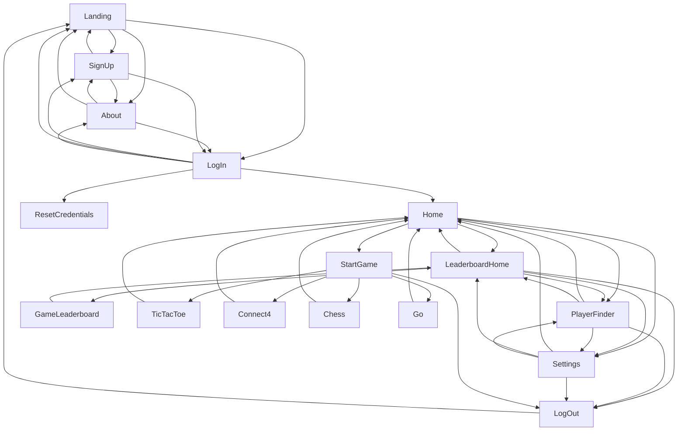

# GUI System Design Document

## Table of Contents
1. [System Overview](#system-overview)
2. [Detailed Class Specifications](#detailed-class-specifications)
3. [Integration Points](#integration_points)
4. [Error Handling](#error-handling)

## System Overview
The GUI system provides:
- A visual interface for users to interact with

## Detailed Class Specifications

### 1. GUI Controllers

| Controller Name              | Purpose                    |
|------------------------------|----------------------------|
| AboutController              | Display info about project |
| ChessController              | Displays chess game        | 
| Connect4Controller           | Displays connect4 game     | 
| FriendFinderController       | Displays friend finder screen|
| GoController                 | Displays go game           |  
| HomeController               | Displays home screen       | 
| LandingController            | Displays landing screen    |
| LeaderBoardController        | Displays leaderboard       |
| LogInController              | Displays log in screen     |
| MatchHistoryController       | Displays match history     |  
| ProfileController            | Displays user's profile    | 
| ResetCredentialsController   | Displays reset credentials screen| 
| SettingsController           | Displays settings screen   |
| SignUpController             | Displays screen for user to sign up|
| StartGameController          | Displays all game options for user to begin game| 
| TicTacToeController          | Displays tictactoe game    | 

### Pop-ups

| Controller Name              | Purpose                    |
|------------------------------|----------------------------|
| ProfilePopUp                 | Display player profile     |
| chatPopUpController          | UI for users to chat with each other| 

### 2. Main
Purpose: To run program

### 3. GameApplication
Purpose: To launch GUI

## Integration Points

1. **Game Logic** → `StartGameController`  
   - Begin game of user's choice  
        1.1) **Chess Logic** → `ChessContoller`  
        - Chess game recieves input from user  
    1.2) **Connect 4 Logic** → `Connect4Contoller`  
        - Connect 4 game recieves input from user  
    1.3) **Go Logic** → `GoContoller`  
        - Go game recieves input from user  
    1.4) **TicTacToe Logic** → `TicTacToeContoller`  
        - TicTacToe game recieves input from user  
2. **Authentication and Profile** → `LogInController`  
   - Ensures that user input matches profile in database  
   → `ProfileController`  
   - User can view profile info  
   → `SettingsController`  
   - User can change profile info via GUI  
   → `ResetCredentialsController`  
   - Allows user to reset password via GUI  
   → `SignUpController`  
   - Allows user to create new account via GUI  
   → `FriendFinderController`  
   - Allows user to find friend via GUI  
3. **Matchmaking and Leaderboard** → `LeaderboardController`  
   - User can view leaderboard for all games  
   → `MatchHistoryController`  
   - User can view match history for all games  
   → `ProfileController`  
   - User can view game stats in profile  

## Error Handling
- Errors should be handled by backend
- GUI may display error message 
