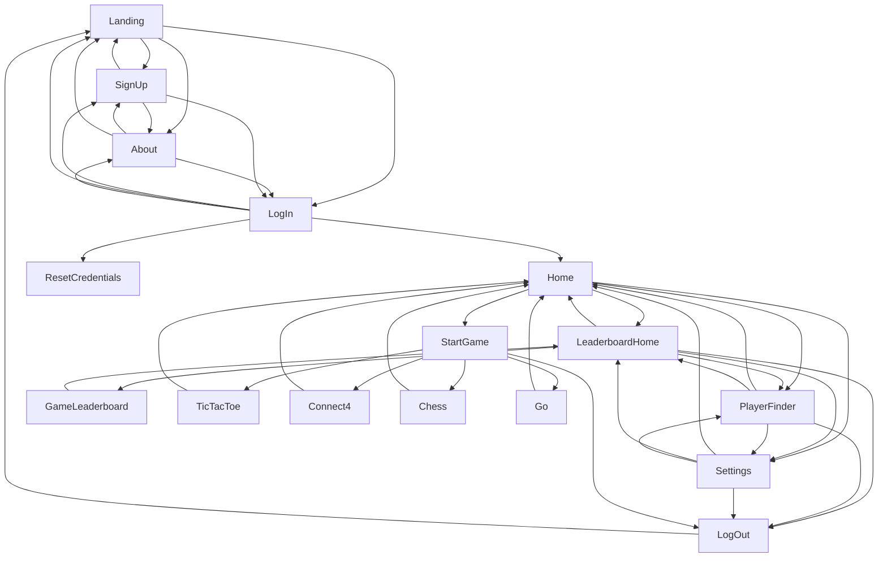

# GUI System Design Document

## Table of Contents
1. [System Overview](#system-overview)
2. [Class Diagram](#class-diagram)
3. [Detailed Class Specifications](#detailed-class-specifications)
4. [Integration Points](#integration_points)
6. [Error Handling](#error-handling)

## System Overview
The GUI system provides:
- A visual interface for users to interact with

## Class Diagram

## Detailed Class Specifications

### 1. GUI Controllers

| Controller Name              | Purpose                    |
|------------------------------|----------------------------|
| AboutController              | Display info about project |
| ChessController              | Displays chess game        | 
| Connect4Controller           | Displays connect4 game     | 
| FriendFinderController       | Displays friend finder screen|
| GoController                 | Displays go game           |  
| HomeController               | Displays home screen       | 
| LandingController            | Displays landing screen    |
| LeaderBoardController        | Displays leaderboard       |
| LogInController              | Displays log in screen     |
| MatchHistoryController       | Displays match history     |  
| ProfileController            | Displays user's profile    | 
| ResetCredentialsController   | Displays reset credentials screen| 
| SettingsController           | Displays settings screen   |
| SignUpController             | Displays screen for user to sign up|
| StartGameController          | Displays all game options for user to begin game| 
| TicTacToeController          | Displays tictactoe game    | 

Pop-ups

| Controller Name              | Purpose                    |
|------------------------------|----------------------------|
| ProfilePopUp                 | Display player profile     |
| chatPopUpController          | UI for users to chat with each other| 

## Error Handling
- Errors should be handled by backend
- GUI may display error message 
