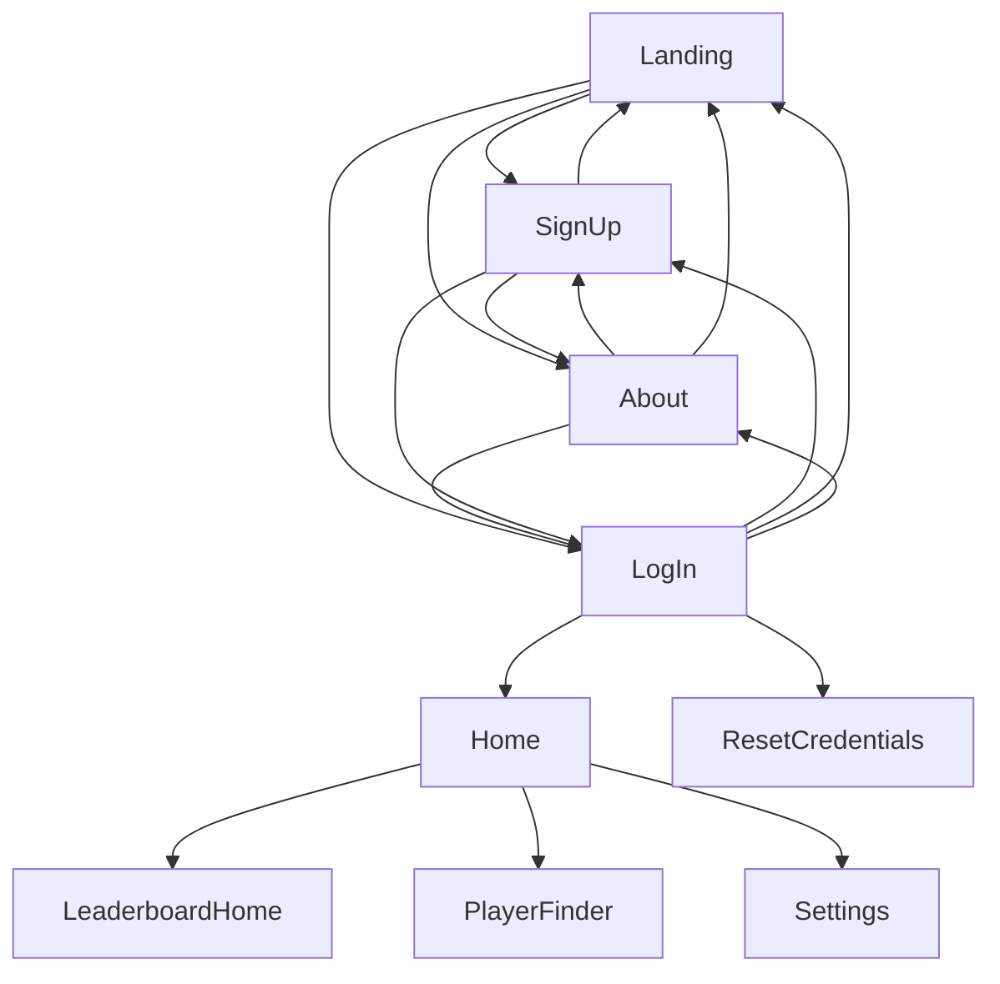

# GUI System Design Document

## Table of Contents
1. [System Overview](#system-overview)
2. [Class Diagram](#class-diagram)
3. [Detailed Class Specifications](#detailed-class-specifications)
4. [Integration Points](#integration_points)
6. [Error Handling](#error-handling)

## System Overview
The GUI system provides:
- A visual interface for users to interact with

## Class Diagram

## Detailed Class Specifications

### 1. GameApplication

### 2. Main

### 3. AboutController

### 4. ChessController

### 5. Connect4Controller

### 6.
## Integration Points

## Error Handling

