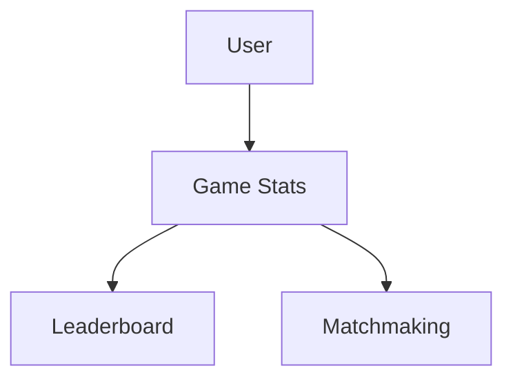
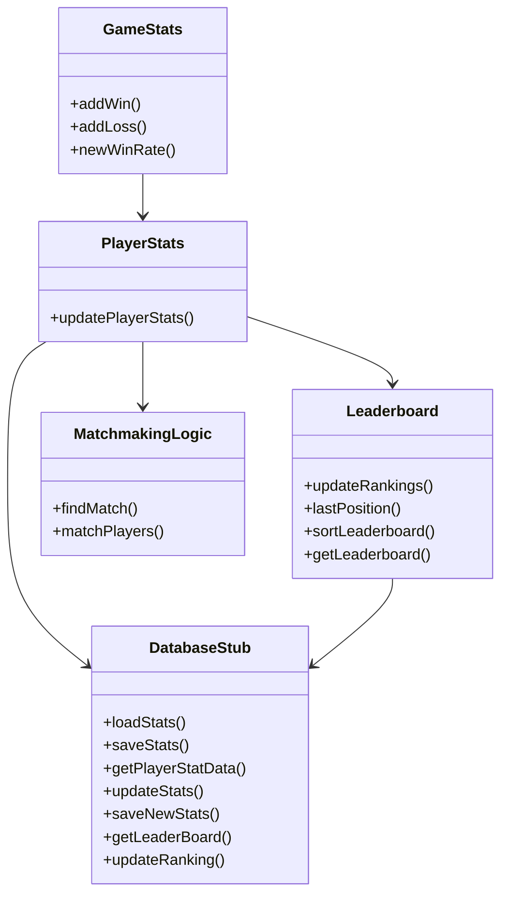

# Authentication System Design Document

## Table of Contents
1. [System Overview](#system-overview)
2. [Class Diagram](#class-diagram)
3. [Detailed Class Specifications](#detailed-class-specifications)
4. [Key APIs](#key-apis)
5. [Data Storage](#data-storage)
6. [Error Handling](#error-handling)

## System Overview
The leaderboard and matchmaking system provides:
- Individual game stats for each user
- Leaderboard based on players game stats
- Matchmaking based on players stats

## Class Diagram

## Detailed Class Specifications

## Key APIs

## Data Storage

## Error Handling

