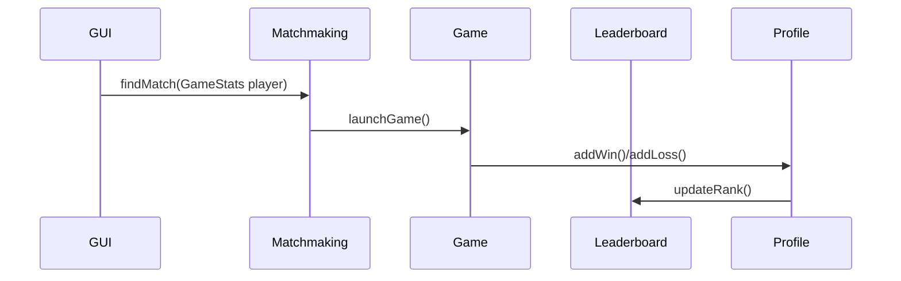

# Leaderboard & Matchmaking System Integration Document

## 1. Overview
### Purpose
- Update players position in leaderboard post match
- Match players to suitable opponents
- Update players individual/profile stats post match
- Update players match history

### Audience
- Game Logic
- Authentication/Profile
- Networking
- GUI

## 2. Suggested Integration API

## 3. Data Flow

## 4. Error Management

## 5. Suggested Integration Steps

## 6. Testing

| Test Case            | Expected Result                      |
|----------------------|--------------------------------------|
| `Game win`           | Profile stats and leaderboard updated|
| `Game loss`          | Profile stats and leaderboard updated|
| `Opponent leaves ongoing match`| Match is marked as win for player and profile stats and leaderboard updated|
