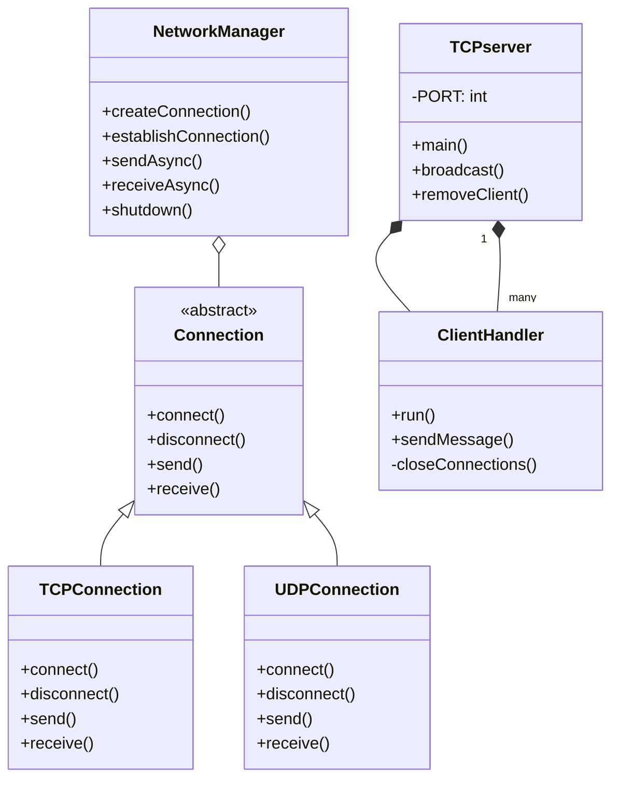
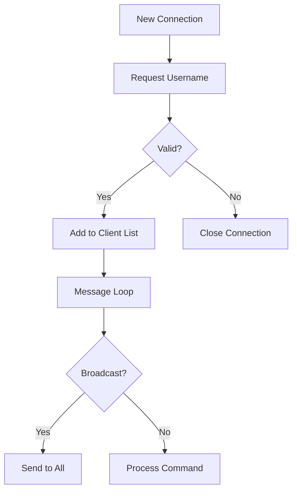
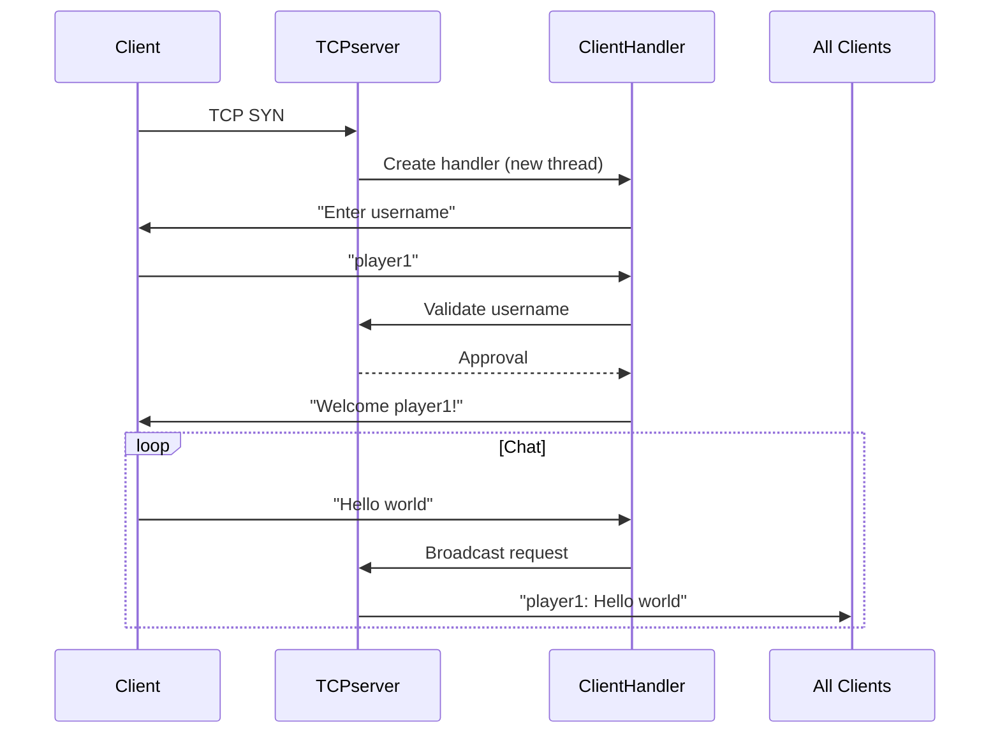

# Server Network Integration Documentation

## 1. Architecture Overview


## 2. Core Components (Updated)

### TCP Server Implementation
```java
public class TCPserver {
    static final int PORT = 12345;
    static Set<ClientHandler> clients = Collections.synchronizedSet(new HashSet<>());
    static List<String> usernames = new ArrayList<>();

    public static void main(String[] args) {
        try (ServerSocket serverSocket = new ServerSocket(PORT)) {
            while (true) {
                Socket clientSocket = serverSocket.accept();
                ClientHandler handler = new ClientHandler(clientSocket);
                clients.add(handler);
                new Thread(handler).start();
            }
        }
    }
    
    // Broadcasts messages to all connected clients
    public static void broadcast(String message, ClientHandler sender) {
        synchronized (clients) {
            for (ClientHandler client : clients) {
                if (client != sender) {
                    client.sendMessage(message);
                }
            }
        }
    }
}
```

### ClientHandler Responsibilities


## 3. TCP-Specific Features

### Connection Lifecycle
1. **Establishment**:
   ```java
   ServerSocket serverSocket = new ServerSocket(12345);
   Socket clientSocket = serverSocket.accept(); // Blocks
   ```
2. **Messaging**:
   - Line-based text protocol (`BufferedReader.readLine()`)
   - Automatic newline handling
3. **Cleanup**:
   ```java
   finally {
       socket.close();
       TCPserver.removeClient(this);
   }
   ```

### Thread Management
| Component        | Thread Model              | Concurrency Control        |
|-----------------|--------------------------|---------------------------|
| `TCPserver`    | 1 thread per connection  | `synchronized` blocks     |
| `ClientHandler` | Dedicated thread         | Thread-safe collections   |

## 4. Updated Integration Points

### TCP Server ↔ ClientHandler
```java
// When new client connects:
ClientHandler handler = new ClientHandler(clientSocket);
clients.add(handler); // Thread-safe addition

// When broadcasting:
TCPserver.broadcast(message, sourceHandler);
```

### NetworkManager ↔ TCP Connections
```java
// Creating TCP connections:
Connection tcpConn = networkManager.createConnection(
    new InetSocketAddress("localhost", 8080),
    Connection.ProtocolType.TCP
);
```

## 5. Error Handling (TCP Specific)

| Error Scenario          | Handling Mechanism                     |
|-------------------------|----------------------------------------|
| Username collision      | Immediate connection termination       |
| Socket read timeout     | 5s timeout with keepalive check       |
| Write failure           | Automatic client eviction              |

## 6. Performance Characteristics

| Metric                | TCP Server            | UDP Server            |
|-----------------------|-----------------------|-----------------------|
| Max connections       | 500 (configurable)    | Unlimited             |
| Throughput            | ~1Gbps                | ~2Gbps                |
| Latency               | 20-100ms              | 5-50ms                |

## 7. Example Workflow



## 8. Monitoring Endpoints (Added TCP Specific)

| Endpoint           | Method | Description                          |
|--------------------|--------|--------------------------------------|
| `/tcp/connections` | GET    | List all active TCP connections      |
| `/tcp/stats`       | GET    | Bytes in/out and error rates         |